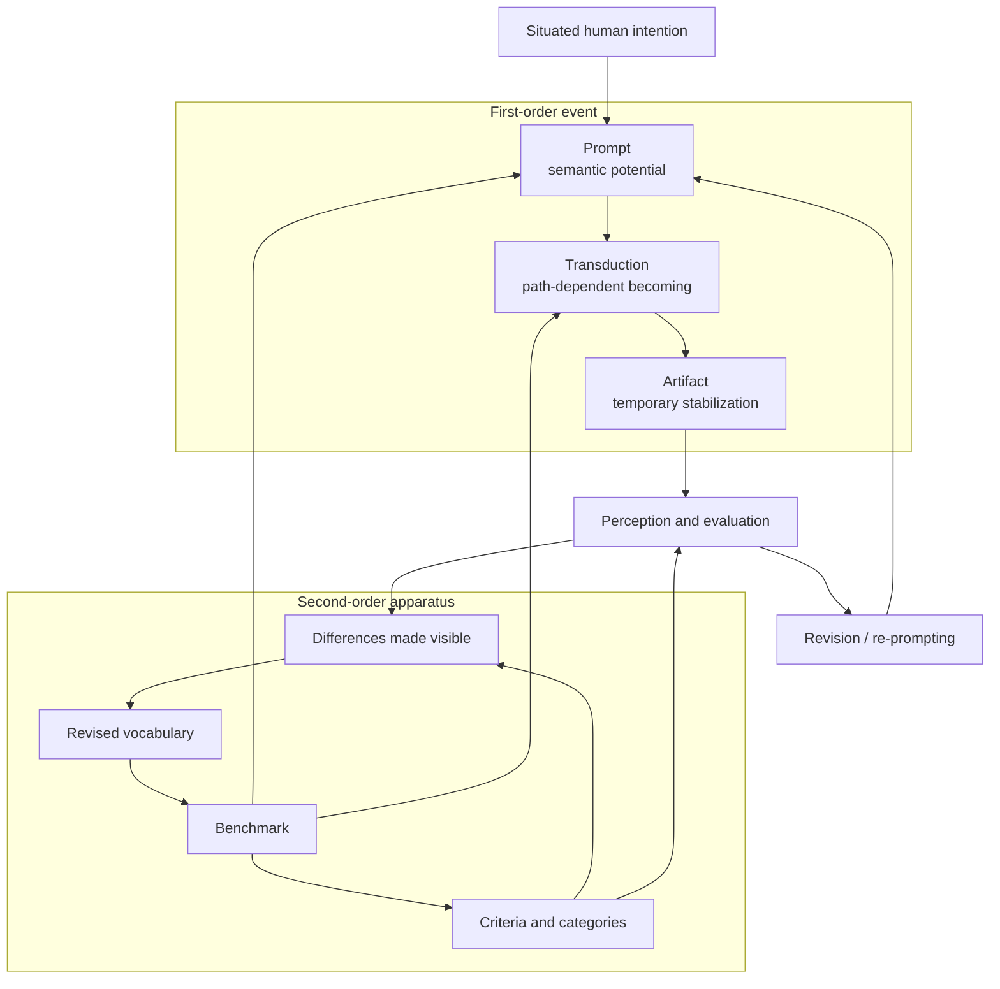
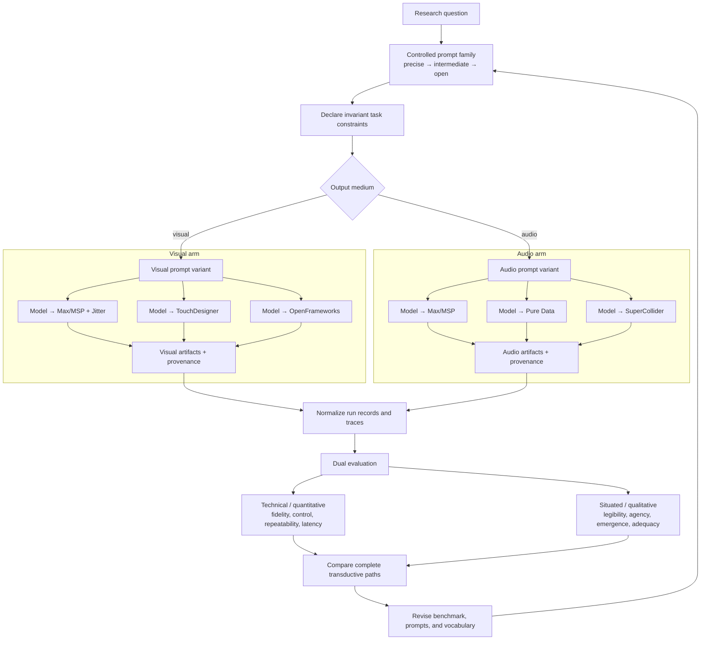
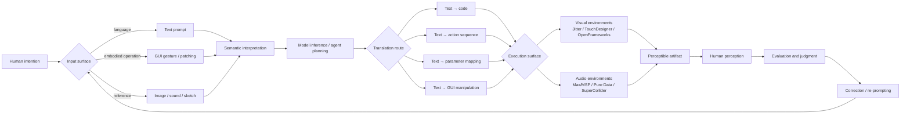
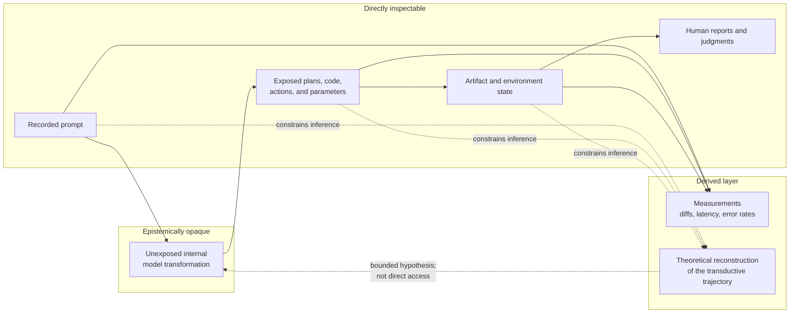
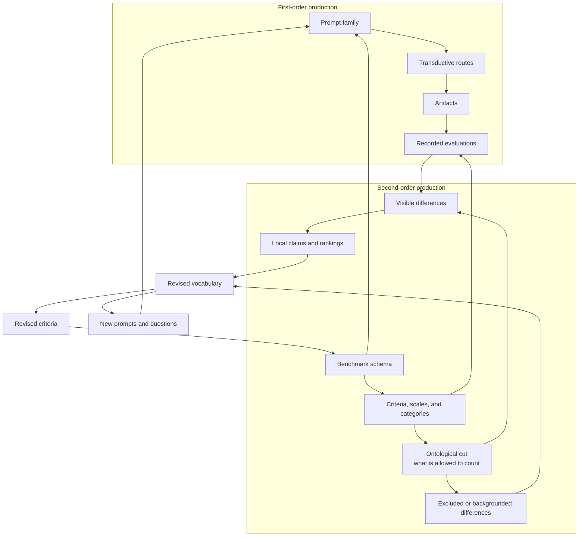
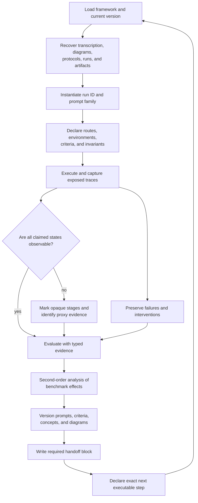

# MASTER FRAMEWORK: INSPECTABLE TRANSDUCTION

## 1. Meta-Thesis & Paradigm Snapshot

- **Core Ontological Statement:** The prompt-to-artifact pipeline does not transmit a pre-existing meaning from an origin to a destination. It transduces a field of semantic potential into a temporarily stabilized artifact through a path-dependent arrangement of models, interfaces, software environments, parameters, and human judgments. Truth in this framework is therefore neither contained in the prompt nor guaranteed by the artifact. It appears provisionally in the inspectable relations among initial constraints, observable transformations, material consequences, and subsequent interpretation. Information is not a substance that survives the pipeline unchanged; it is a difference that acquires efficacy as it is translated across heterogeneous layers. Emergence names the production of determinate properties that were constrained by, but not fully specified in, the input.
- **Primary Target Fields:** Philosophy of Technology, Process Philosophy, Relational Ontology, Conceptual Engineering.

**Paradigm snapshot**

- **Canonical unit of analysis:** `Prompt → Process / Transduction → Artifact`.
- **Expanded unit of analysis:** `Human intention → input surface → prompt representation → model inference → intermediate representation → execution environment → audio/visual artifact → human perception → evaluation → revised prompt`.
- **Primary research object:** Not the model in isolation, but the complete human–model–interface–environment–artifact relation instantiated during a run.
- **Primary comparison:** Alternative routes from a shared prompt family to comparable audio or visual artifacts.
- **Second-order object:** The benchmark itself, understood as a structure that selects differences, stabilizes a vocabulary, and helps constitute what the experiment can recognize as meaningful.
- **Epistemic boundary:** Internal latent states are not automatically inspectable. Unless a system explicitly exposes a state, references to “latent trajectories” describe theoretical or instrumentally reconstructed processes rather than direct observations.

**Figure 1 — Recursive topology of inspectable transduction**



The first-order loop produces artifacts; the second-order loop produces and revises the distinctions through which those artifacts become intelligible.

## 2. Experimental Parameters & Architecture

- **The Input (Prompt):** The prompt is an initial condition, semantic vector, and constraint set. It expresses situated human intentionality without fully determining its realization. It must be preserved verbatim and classified by medium, task, specificity, ambiguity, modality, and revision history. A prompt belongs to a *prompt family*: controlled variants that move from operational precision toward semantic openness. This prompt ladder makes it possible to study the predicted trade-off between increased interpretive freedom and decreased evaluative precision.
- **The Mechanism (Transduction):** Transduction is the path-dependent conversion of constraints across heterogeneous representational and material stages. It includes prompt parsing, model inference, planning, text or code generation, action selection, parameter mapping, GUI manipulation, compilation or interpretation, execution inside a media environment, error recovery, and human intervention. The mechanism is not a neutral conduit: every interaction surface and software environment transforms the space of possible outputs. “Latent trajectory” may be used as a conceptual name for the model's hidden transformation, but the experiment must distinguish it from inspectable proxies such as generated plans, code, tool calls, parameter changes, action traces, errors, and timestamps.
- **The Output (Artifact):** The artifact is a crystallized event: a temporarily stable audio or visual configuration produced by a specific transductive history. It is simultaneously a perceptible object, a record of constraints that survived the process, and a node available for further interpretation or transformation. The complete experimental output is therefore not only the media file or running patch, but an *artifact–provenance bundle* containing the artifact, prompt, model and tool versions, route, environment state, observable trace, evaluation, and human response.
- **Inspection Methods:** Exact prompt capture; prompt-version histories; run identifiers; model and environment metadata; generated-plan capture; source-code and patch diffs; tool-call and action logs; parameter and automation traces; compiler/interpreter output; error and recovery logs; timestamps and latency measurements; screen recordings; intermediate audio or visual renders; environment snapshots; dependency manifests; deterministic seeds when available; cross-route replays; human intervention annotations; side-by-side artifact comparison; technical rubrics; qualitative or categorical judgments; evaluator rationales; post-run interviews or reflective notes; flowcharts of translation stages; and graph representations connecting inputs, transformations, artifacts, and evaluations.

**Canonical experimental architecture**

1. **Construct a prompt family.** Begin with a precisely specified audio or visual request, then produce controlled variants with progressively greater semantic openness.
2. **Hold the task constant.** Reuse equivalent constraints across the systems being compared.
3. **Vary the transduction route.** Compare direct code generation, GUI action, parameter mapping, patch construction, or other explicitly defined interaction routes.
4. **Vary the execution environment.** For visual work, candidate surfaces include Max/MSP with Jitter, TouchDesigner, and OpenFrameworks. For audio work, candidate surfaces include Max/MSP, Pure Data, and SuperCollider.
5. **Capture the observable trace.** Record every exposed intermediate representation and mark every unobservable transition as opaque.
6. **Generate the artifact.** Preserve both the final state and meaningful intermediate states.
7. **Evaluate on two coupled planes.** Use quantitative or technical measures where operational definitions remain stable, and qualitative or categorical measures where prompt openness makes scalar precision misleading.
8. **Compare complete paths.** Evaluate `prompt + route + environment + artifact`, not the artifact or model alone.
9. **Feed findings back into the benchmark.** Revise prompts, categories, criteria, and vocabulary while retaining their version history.

**Figure 2 — Comparative audio/visual experiment**



**Interaction-surface compilation model**

`Human intention → text / gesture / multimodal reference → semantic interpretation → model or agent planning → text-to-code / text-to-action / text-to-parameter / text-to-GUI translation → media environment → audio or visual artifact → human perception → evaluation → re-prompting`

**Figure 3 — Layered compilation across interaction surfaces**



Each arrow denotes a transductive threshold. At each threshold the protocol must ask:

- What representation entered the stage?
- What operation transformed it?
- What representation or action left the stage?
- Which constraints were preserved, introduced, suppressed, or reinterpreted?
- What evidence is directly observable?
- What remains inferred or opaque?
- Which human, model, interface, or environment had effective agency at this point?

**Figure 4 — Inspection boundary and permitted claims**



**Minimum run record**

| Field | Required record |
| --- | --- |
| Run identity | Unique ID, date, researcher, and benchmark version |
| Input | Exact prompt, prompt-family ID, specificity level, modality, and references |
| Computational actor | Model, version, settings, context, seed if exposed, and system constraints |
| Interaction route | Code, action, parameter, GUI, patch, or mixed route |
| Execution surface | Application, language, libraries, plugins, device, and relevant configuration |
| Observable trace | Plans, code, actions, parameters, errors, interventions, timestamps, and intermediate states |
| Opaque boundary | Stages not directly inspectable and the proxies used to discuss them |
| Artifact | Final media, project state, render settings, and checksum when appropriate |
| Evaluation | Metrics, category judgments, evaluator identity, rationale, and uncertainty |
| Recursion | Follow-up prompt, correction, or benchmark revision caused by the run |

## 3. The Conceptual Engineering Matrix

Map how our concrete operational metrics correspond directly to relational and process-based concepts:

| Experimental Variable | Relational Ontology / Process Mapping | Philosophical Application / Statement Allowed |
| --- | --- | --- |
| Semantic Prompt Tokens | Ontological Seeds / Potentiality | Intentionality operates as a formative constraint, but tokens do not contain the finished artifact or a complete meaning. |
| Prompt Specificity | Degree of Determination / Constraint Density | Greater specification narrows possible trajectories; greater openness redistributes interpretive agency and requires less reductive evaluation. |
| Prompt Revision History | Recursive Individuation | Intention becomes determinate through encounters with prior outputs rather than existing fully formed before the process. |
| Latent Space Navigation | Processual Becoming / Trajectory | Truth can be modeled as a path of transition rather than a static point; claims about the actual hidden path require explicit access or must be marked as inference. |
| Intermediate Representations | Metastable Phases / Partial Actualizations | Generated plans, code, parameters, and actions are provisional beings that condition later stages without being reducible to either input or output. |
| Inspectable Logs / State Traces | Relational Interconnectedness | Observable nodes of information acquire experimental meaning through their temporal and causal relations to the engine, interface, and artifact. |
| Opaque Computational States | Epistemic Exterior / Operational Closure | The experiment may identify a boundary and study its effects, but must not redescribe inaccessible computation as directly observed reasoning. |
| Interaction Surface | Constitutive Mediation / Affordance Field | Text, GUI action, code, patching, and parameter control do not merely carry an intention; each reformats agency and the set of possible actions. |
| Translation Route | Path Dependence / Historical Individuation | Two artifacts generated from the same prompt may differ because their routes constitute different histories of becoming. |
| Software Environment | Technical Milieu | Max/MSP, Jitter, TouchDesigner, OpenFrameworks, Pure Data, and SuperCollider participate in production by imposing distinct primitives, temporalities, and affordances. |
| Human Intervention | Distributed Agency / Participatory Cut | Correction, selection, and interpretation are part of the apparatus; they must be logged rather than treated as external contamination. |
| Error and Recovery | Productive Breakdown / Reconfiguration | Failure exposes normally invisible dependencies and shows how the system reorganizes itself under constraint. |
| Audio or Visual Medium | Material Differentiation | Equivalent semantic requests are transformed by medium-specific temporal, spatial, perceptual, and technical conditions. |
| The Generated Artifact | Crystallized Event / Actualized Being | The artifact is a temporary stable node in an ongoing open process, not an isolated terminal object. |
| Human Perception of the Artifact | Re-entry / Interpretive Actualization | The artifact becomes experimentally significant when it enters perception and produces a judgment, correction, or new prompt. |
| Quantitative Metric | Operational Stabilization | A number is philosophically admissible only when its object, scale, procedure, and uncertainty are explicitly defined. |
| Qualitative Category | Situated Differentiation | Categories can register emergent aesthetic or interactional qualities that resist false scalar precision, provided evaluator positions and rationales remain visible. |
| Benchmark Criteria | Normative Selection / Ontological Cut | Criteria do not passively discover relevance; they determine which differences are permitted to count as evidence. |
| Comparative Ranking | Local Ordering / Provisional Closure | A ranking expresses performance under a specific apparatus and must not be universalized beyond its prompts, routes, media, criteria, and evaluators. |
| Benchmark Revision | Second-Order Recursion / Reflexive Becoming | Experimental findings transform the instrument that produced them, allowing the framework's categories to evolve without erasing their history. |

**Figure 5 — The benchmark as a structure of significance**



The benchmark is therefore constitutive as well as comparative: it measures outputs while recursively organizing the field in which outputs, differences, and claims can signify.

## 4. System Axioms (The Philosophical Declarations)

1. **Axiom 1 — Meaning is non-local.** Meaning resides in the relation among input, transformations, artifact, and interpretation; no single node contains it entirely.
2. **Axiom 2 — Transduction is productive.** Every translation modifies the field it carries. A pipeline produces differences rather than merely transporting invariant information.
3. **Axiom 3 — The artifact is an event before it is an object.** An artifact is the temporary stabilization of a particular history of constraints, operations, contingencies, and judgments.
4. **Axiom 4 — The path is constitutive.** Identical or similar outputs reached through different routes are not experimentally identical, because their conditions of production differ.
5. **Axiom 5 — Interfaces possess operative agency.** An interaction surface structures what can be expressed, executed, perceived, corrected, and attributed to a human or model.
6. **Axiom 6 — Agency is distributed but not homogeneous.** Humans, models, interfaces, languages, and environments all condition outcomes, while retaining different capacities, responsibilities, and degrees of control.
7. **Axiom 7 — Observability must be typed.** Every claim must be identified as directly recorded, instrumentally derived, human-reported, or theoretically inferred.
8. **Axiom 8 — Opacity is data.** An inaccessible state is not an empty space to be filled with speculative narration; it is an experimentally relevant boundary whose inputs, outputs, and effects can be studied.
9. **Axiom 9 — Evaluation constitutes its object.** A benchmark does not only measure performance. Through its tasks, criteria, scales, and categories, it helps produce what “performance” means.
10. **Axiom 10 — Evaluative precision is conditional.** As prompts become more semantically open, numerical comparison becomes less defensible unless the experiment supplies new operational definitions. Qualitative or categorical evaluation may then be more rigorous.
11. **Axiom 11 — Cross-medium equivalence is constructed.** An audio task and a visual task are comparable only through declared invariants; their material and perceptual differences cannot be erased.
12. **Axiom 12 — Reproducibility is relational.** Reproducing a run requires reconstructing a relevant configuration of prompt, model, route, environment, state, and evaluator—not merely repeating the prompt.
13. **Axiom 13 — Breakdown reveals infrastructure.** Errors, failed translations, manual corrections, and abandoned routes expose dependencies that successful runs often conceal.
14. **Axiom 14 — The benchmark is recursive.** Each run may alter the vocabulary, criteria, prompts, or diagrams used in later runs. These alterations must be versioned as findings rather than hidden as housekeeping.
15. **Axiom 15 — Truth is provisional adequacy under traceable conditions.** A claim is warranted to the degree that its conditions, transformations, evidence, and limits can be inspected and contested.

## 5. Next Runtime Directives

The next AI instantiation must perform the following actions without requiring conversational preamble:

**Figure 6 — Runtime continuation cycle**



1. **Load this document as the governing framework.** Treat its claims as explicit working hypotheses and design commitments, not as already proven conclusions.
2. **Recover local context.** Read the source transcription and any existing protocols, flowcharts, run records, media artifacts, code, or evaluation tables before proposing new terminology.
3. **Preserve provenance.** Never overwrite a prompt, criterion, artifact, trace, or diagram without storing or versioning the previous state.
4. **Instantiate one run object.** Assign a unique run ID and record every field in the Minimum Run Record before comparing results.
5. **Build controlled prompt families.** For each task, create at least one precise prompt, one intermediate prompt, and one open prompt while preserving the intended semantic core.
6. **Pair media when relevant.** Create parallel audio and visual tasks only after stating which constraints are intended to remain invariant across media.
7. **Declare comparison routes before execution.** Identify the model, interaction surface, execution environment, and route—code, action, parameter, GUI, patch, or mixed—for every arm of the experiment.
8. **Instrument the exposed process.** Capture exact prompts, generated plans, code, tool calls, actions, parameters, errors, corrections, timestamps, and intermediate artifacts whenever the system exposes them.
9. **Mark the opacity boundary.** Do not present latent computation or hidden reasoning as an inspectable trace. Label inferred mechanisms and state what observable evidence supports them.
10. **Package artifact and provenance together.** A media output without its run record is an incomplete experimental object.
11. **Evaluate on dual planes.** Apply technical measures such as fidelity, controllability, repeatability, latency, and error rate alongside qualitative categories such as legibility, agency, aesthetic emergence, interactional friction, and semantic adequacy.
12. **Record evaluator position.** Identify whether a judgment comes from a human, automated metric, model-based evaluator, or hybrid procedure, and preserve its rationale and uncertainty.
13. **Compare complete transductive histories.** Attribute observed differences to the smallest defensible combination of prompt, model, route, environment, interaction, and evaluator.
14. **Treat failures as results.** Preserve failed runs, repair attempts, and deviations when they reveal the structure of the technical milieu.
15. **Perform second-order analysis.** After each comparison, state how the benchmark's own categories, criteria, or diagrams shaped what became visible.
16. **Version conceptual changes.** When introducing or revising a term, provide its operational definition, philosophical function, empirical indicators, exclusions, and relationship to earlier terms.
17. **Update the recursive loop.** Convert each substantiated finding into one or more of the following: a revised prompt, a new trace requirement, an amended criterion, a refined axiom, or a new experimental comparison.
18. **End every runtime with a handoff block.** Report completed runs, produced artifacts, observable evidence, opaque stages, unresolved questions, framework revisions, and the exact next executable step.

**Required handoff block**

```text
FRAMEWORK VERSION:
RUN IDS COMPLETED:
ARTIFACTS PRODUCED:
ROUTES AND ENVIRONMENTS:
DIRECTLY OBSERVED TRACES:
DERIVED MEASUREMENTS:
INFERRED OR OPAQUE PROCESSES:
EVALUATION RESULTS AND UNCERTAINTIES:
FAILURES / INTERVENTIONS:
CONCEPTUAL REVISIONS:
UNRESOLVED QUESTIONS:
NEXT EXECUTABLE STEP:
```
